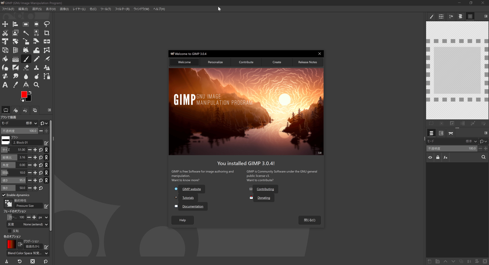

## 状況

Windows上のすべてのアプリをパッケージマネージャーのScoop(UniGetUi)に引っ越ししているときに、GIMPのアイコン問題設定方法を再調査した

## 調査結果

### 従来のやり方

設定=>ユーザーインターフェース=>アイコンテーマ=>アイコンサイズをカスタムする=>とても大きい
を選択

[https://chocolat-au-lait.com/gimp-icon-big-icon-change/](https://chocolat-au-lait.com/gimp-icon-big-icon-change/)

### v3以降

2025年3月17日にv3.0.0が発表された

設定なしで、4Kなどの高DPIに対応

> 従来のアイコンテーマは主にラスター PNG 形式だったため、GTK3 のスケーリングシステムを活用できませんでした。貢献者の**Denis Rangelov**氏は、従来のツールアイコンを SVG 形式で再現するという大きな課題に取り組みました。その結果、 GIMPのどちらのアイコンテーマも 高DPI 画面で美しく表示されるようになりました。

[https://www.gimp.org/news/2024/11/06/gimp-3-0-RC1-released/](https://www.gimp.org/news/2024/11/06/gimp-3-0-RC1-released/)

これを見る限りでは、アイコンを高DPIに対応させたのはDenis Rangelov氏のたった1人の仕事の様だ
大感謝
