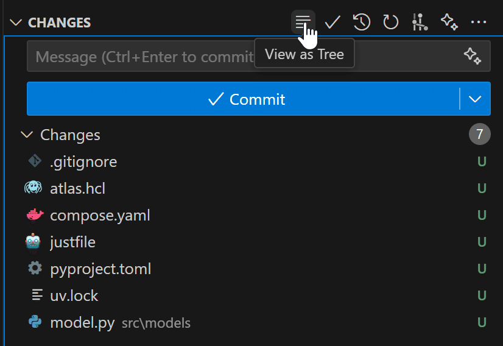
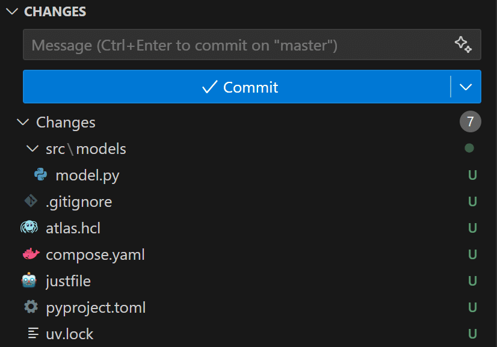
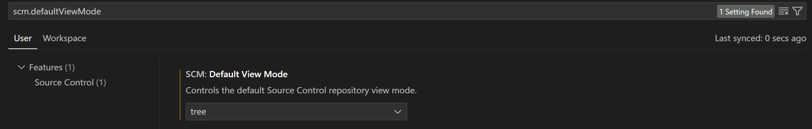

## 状況

vscodeにおいてgitの未適用ファイルの表示を常に"View as Tree"にしたいが
新しいプロジェクトでは、デフォルト"View as List"に設定されていて、毎度変更するのが面倒

### デフォルトのフラット表示

デフォルトでは下図の通りの表示になっていて、カーソルをおいてるボタンをクリックすると表示が切り替わる



### 変更後のツリー構造表示

ボタンクリック後



## 設定方法

下記の通り設定できる

```json title="settings.json"
{
  "scm.defaultViewMode": "tree"
}
```



## 参考

[https://www.reddit.com/r/vscode/comments/1guqniy/how_to_make_the_vcsgit_panel_always_default_to/](https://www.reddit.com/r/vscode/comments/1guqniy/how_to_make_the_vcsgit_panel_always_default_to/)
