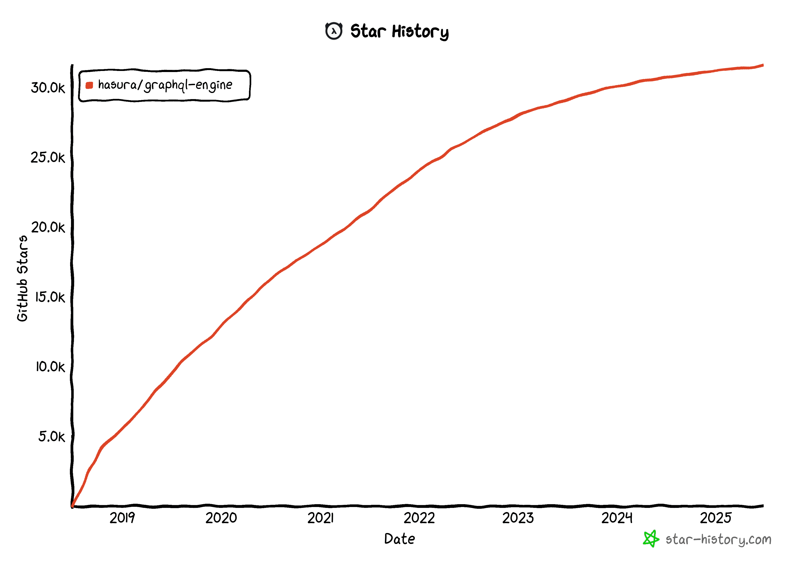

## 状況

### API経由でDatabaseを操作したい

ウェブサイトからDatabaseのデータを取得、操作したい
となるとWebAPI経由でしかないが、CRUD定義済みAPIを提供してほしい
でも、REST APIだと、読みにくそうなので、GraphQLの方が扱いやすそうな気がする

### 要件を満たすもの

hasura, supabase, postgraphile か

## hasuraは人気が低迷か

昔はよかったんだけどねえ、っていう意見をよく見かける

> 過去数年間、アップデートは一般開発者にとってほとんど、あるいは全く価値を提供していません。hasuraの将来について懸念を抱いています。
> Hasura の進む方向が気に入らない

[https://dev.to/kylebuildsstuff/hasura-and-nhost-vs-supabase-1hb9](https://dev.to/kylebuildsstuff/hasura-and-nhost-vs-supabase-1hb9)

> 理解しにくい製品
> オープンソースプロジェクトですらない
> RIP hasura

[https://www.reddit.com/r/Hasura/comments/1hxolvt/self_hosting_hasura_v3/](https://www.reddit.com/r/Hasura/comments/1hxolvt/self_hosting_hasura_v3/)

> ハスラはv3では生き残れないと思う

[https://www.reddit.com/r/Hasura/comments/1hxolvt/self_hosting_hasura_v3/](https://www.reddit.com/r/Hasura/comments/1hxolvt/self_hosting_hasura_v3/)

## hasuraに感じた不満

### hasura cliに改善点はあるけれど、v2は、もう開発されない

> v3をリリースします。
> v3 CLIで、このような要件をサポートします。

[https://github.com/hasura/graphql-engine/issues/1418](https://github.com/hasura/graphql-engine/issues/1418)

### v3 は、self-host できない

hasura はセルフホストできるはずなのに、v3のセルフホストドキュメントがない

> いろいろ調べた結果、DDNはエンタープライズライセンスがないとセルフホスティングできないようです。すべてログインが必要です。

[https://www.reddit.com/r/Hasura/comments/1hxolvt/self_hosting_hasura_v3/](https://www.reddit.com/r/Hasura/comments/1hxolvt/self_hosting_hasura_v3/)
