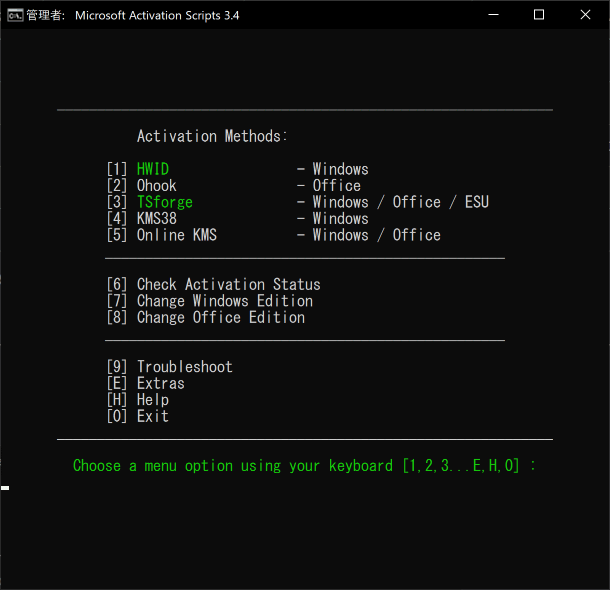
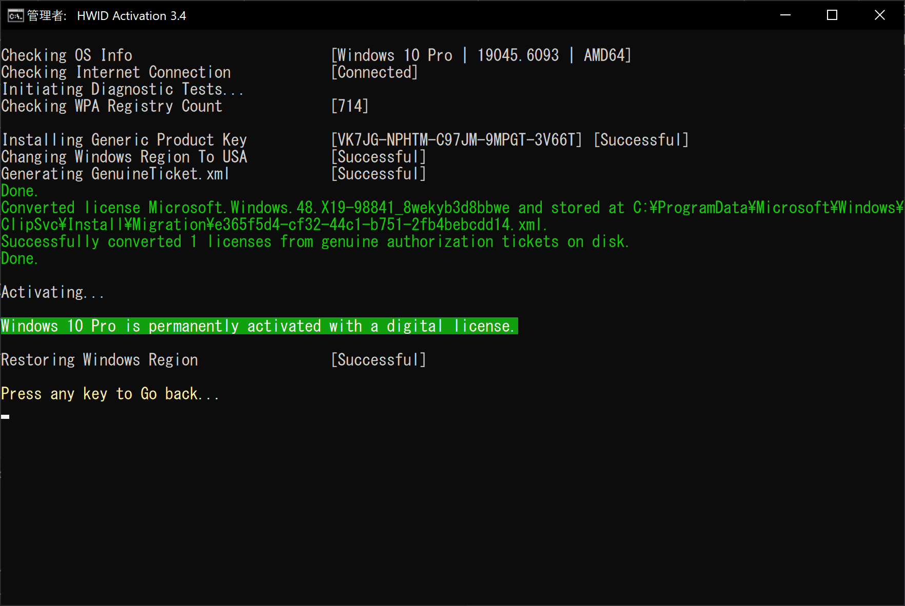

## 状況

PCパーツを変更して、ライセンスが切れた
MSアカウントに紐づけして引き継ぐやり方がいまだに分からないので
Githubで圧倒的に人気なMicrosoft Activate Scripts（以下MAS）を使ってみたい

AliexpressやYahooShoppingで数百円でライセンスキーがたたき売りされているのは、盗難クレカの現金化に使われているのかと思っていたんだけど、まさかOSSスクリプトで生成されていたとはね
技術が0円、仕入れも0円、送料も0円とか最強の錬金術師だよ本当に

## 無料でWindowsライセンス認証をする方法（3秒）

## 1. PowerShellスクリプト実行

PowerShellで
irm https://get.activated.win | iex
を実行
このコマンドでは、MASの最新のpowershellスクリプトをダウンロードして実行している

### 2. UAC（実行確認ダイアログ）がでたらYESを押す

管理者権限必須みたい

### 3. 選択

下図のような画面になる

このうち緑色になっている選択肢から選ぶ
今回でいうと１か３になるので１を押してみる

### 4. 数秒で処理されて完了

はやすぎ

## 補足

やり方リンク
[https://massgrave.dev/#how-to-activate-windows--office](https://massgrave.dev/#how-to-activate-windows--office)

選択肢の比較表
[https://massgrave.dev/#activations-summary](https://massgrave.dev/#activations-summary)

## 所感

面倒くさい設定とかコマンドとかが必要なのかと思ったが、まさかの1コマンドと1選択だけで済むとは驚いた
エンジニアじゃなくても、簡単に実行できるだろう
