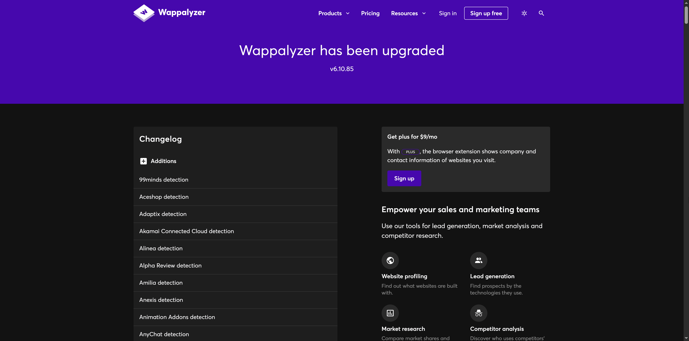
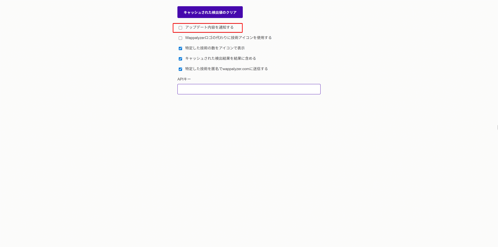

## 状況

頻繁にWappalyzer has been upgradedのページ（タブ）が表示される

## Wappalyzerってなに

Chrome拡張機能として追加しているもので、訪問したウェブサイトの技術スタックを検出する

## なぜいれた

人のウェブサイトでReact使ってるかどうかを調べたかった

## なぜ勝手にタブが表示される

拡張機能の機能で、更新通知をしている

## どうやって抑制する

拡張機能のオプションページで通知チェックを外す

