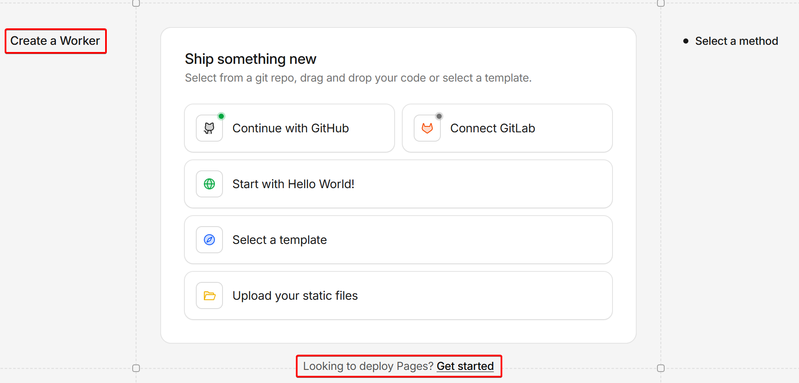

## 状況

Build output directory が見当たらないので調べてみると

> Pagesの作成をしているつもりが、Workersの作成をしてしまっていました
> https://community.cloudflare.com/t/cant-find-build-output-directory-option/769616/3

とのこと
どうやら、私も同じ状況のようだ

既存のWorkerは、Settingsタブの最下部のDeleteボタンで削除して
再度、作成の画面にいってみると添付画像の赤枠の通り
Workerの作成画面であること、そしてPageの作成には別ボタンが用意されていることが分かった

`Get started`のボタンを押して進めると解決した
