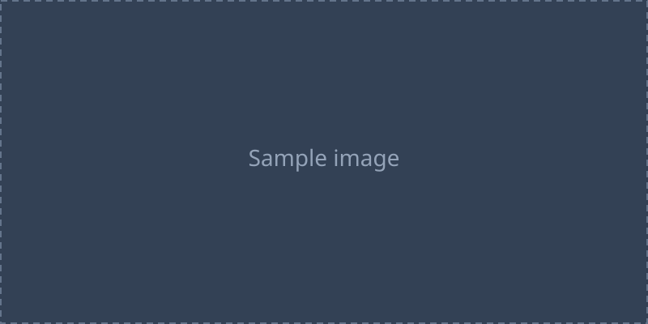

## 見出しレベル2

これは本文の段落である。**太字**、_イタリック_、~~打ち消し線~~、`インラインコード`、そして[リンク](https://example.com)を含む。行末で2つのスペースではなく改行を入れると
同一パラグラフ内で改行(remark-breaks)として表示される。

### 見出しレベル3

#### 見出しレベル4

## リスト

- 箇条書きアイテム1
- 箇条書きアイテム2
  - ネストしたアイテム2-1
  - ネストしたアイテム2-2
- 箇条書きアイテム3

1. 番号付きアイテム1
2. 番号付きアイテム2
   1. ネストしたアイテム2-1
   2. ネストしたアイテム2-2
3. 番号付きアイテム3

- [x] 完了したタスク
- [ ] 未完了のタスク

## 引用

> 引用された文章である。複数行にわたって
> 引用を続けることができる。
>
> > 入れ子の引用である。
>
> 引用に戻る。

## コードブロック

TypeScript のコードブロックである。ジェネリクス `Map<string, number>` のように波括弧や山括弧がエスケープされて表示されることを確認する。

```ts
type Result<T> = { ok: true; value: T } | { ok: false; error: Error };

export function divide(a: number, b: number): Result<number> {
  if (b === 0) {
    return { ok: false, error: new Error("division by zero") };
  }
  return { ok: true, value: a / b };
}
```

AutoHotkey のコードブロックである。

```ahk
#Requires AutoHotkey v2.0

#HotIf WinActive("ahk_exe Code.exe")
^!s:: {
  MsgBox("Save all files")
}
#HotIf
```

インデントなしのインラインな fenced code も表示する。

```
plain fenced block without language
```

## 表

| 左寄せ                               | 中央寄せ | 右寄せ |
| :----------------------------------- | :------: | -----: |
| cell1                                |  cell2   |  cell3 |
| 長いセルの内容も折り返さず表示される |  cellB   |  cellC |

## 水平線

---

## 画像



## 脚注

脚注への参照である[^1]。脚注の内容は文書末尾に表示される。

[^1]: これは脚注の内容である。
